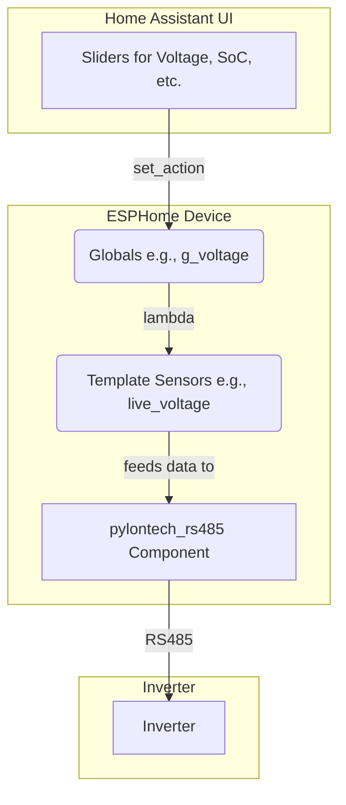

# ESPHome Pylontech RS485 Battery Emulator

An ESPHome component that allows an ESP device to emulate the Pylontech RS485 low-voltage battery protocol. This enables the use of DIY batteries or other battery management systems (like YAM-BMS) with inverters that expect to communicate with a Pylontech-compatible BMS.

## Key Features

*   **Dynamic Data:** Takes live data from ESPHome sensors to report battery status.
*   **Highly Configurable:** All parameters are configurable through your ESPHome YAML file.
*   **Protocol Emulation:** Replicates specific protocol quirks for compatibility with certain inverter brands.

## Project Status & Compatibility

**⚠️ IMPORTANT:** The Pylontech RS485 protocol is not a strict standard. Different inverter manufacturers have implemented their own "dialects" with unique quirks.

This project was developed and tested specifically against an **SRNE-based inverter (rebranded as EcoWorthy)**. It successfully emulates the specific protocol quirks required by this family of inverters.

**Current Confirmed Working Inverters:**
*   SRNE
*   EcoWorthy (All-in-One models)

While the core logic may work for other inverters, it is not guaranteed. We welcome contributions and test reports for other brands.

### The "SRNE Dialect" Discovery

Through extensive reverse-engineering, we discovered that the SRNE inverter requires two key non-standard behaviors from the BMS:

1.  **Fixed Response Address:** The inverter polls multiple battery addresses, but it expects every response to come from the master battery address (`02`).
2.  **Structural Quirk in Frame `62H`:** The protocol has a non-standard format for the LENGTH field (`LCHKSUM` + `LENID`).

This emulator replicates these exact structural quirks to ensure full compatibility with SRNE-based inverters.

## Hardware Prerequisites

To use this component, you will need:

*   An ESP32 or ESP8266 based development board.
*   An RS485 to TTL converter module (e.g., MAX485 module) to interface with the inverter's RS485 port.

## Installation

To include this component in your ESPHome project, add the following to your YAML configuration file:

```yaml
external_components:
  - source: github://fahmula/esphome-pylontech-rs485@next
    refresh: 0s # Optional: Set to a duration (e.g., 1h) to periodically check for updates
```

## Configuration

The `pylontech_rs485` component is configured under its own block in your ESPHome YAML file.

```yaml
pylontech_rs485:
  uart_id: uart_bus # REQUIRED: Link to the UART bus defined elsewhere in your YAML
  
  # --- Core Data (Required for basic operation) ---
  state_of_charge: live_soc
  voltage: live_voltage
  current: live_current
  temperature: live_temperature

  # --- Dynamic Battery Limits (Required for basic operation) ---
  max_voltage: live_max_v
  min_voltage: live_min_v
  max_charge_current: live_max_charge_i
  max_discharge_current: live_max_discharge_i

  # --- Optional Health & Detail Sensors (for full protocol compliance) ---
  # state_of_health: live_soh
  # cycle_count: live_cycle_count
  # max_cell_voltage: live_max_cell_v
  # min_cell_voltage: live_min_cell_v
  # max_temperature: live_max_temp
  # min_temperature: live_min_temp
  # mosfet_temperature: live_mosfet_temp
  # max_mosfet_temperature: live_max_mosfet_temp
  # min_mosfet_temperature: live_min_mosfet_temp
  # bms_temperature: live_bms_temp
  # max_bms_temperature: live_max_bms_temp
  # min_bms_temperature: live_min_bms_temp

  # OPTIONAL: Configure the sensor update timeout
  # If no new data is received from the linked sensors for this duration,
  # the component will stop talking to the inverter.
  # Default: 60s
  update_timeout: 60s

  # --- Optional Alarm and Protection Binary Sensors ---
  # Uncomment and link to ESPHome binary_sensor entities to report alarm and protection statuses.
  # These are typically used for simulation/testing purposes with the pylontech-emulator-example.yaml.
  #
  # Alarm Status 1
  # total_voltage_high_alarm: alarm_total_voltage_high
  # total_voltage_low_alarm: alarm_total_voltage_low
  # cell_voltage_high_alarm: alarm_cell_voltage_high
  # cell_voltage_low_alarm: alarm_cell_voltage_low
  # cell_temp_high_alarm: alarm_cell_temp_high
  # cell_temp_low_alarm: alarm_cell_temp_low
  # mosfet_temp_high_alarm: alarm_mosfet_temp_high
  # cell_imbalance_alarm: alarm_cell_imbalance
  #
  # Alarm Status 2
  # cell_temp_imbalance_alarm: alarm_cell_temp_imbalance
  # charge_overcurrent_alarm: alarm_charge_over_current
  # discharge_overcurrent_alarm: alarm_discharge_over_current
  #
  # Protection Status 1
  # module_overvoltage_protection: protection_module_overvoltage
  # module_undervoltage_protection: protection_module_undervoltage
  # cell_overvoltage_protection: protection_cell_overvoltage
  # cell_undervoltage_protection: protection_cell_undervoltage
  # cell_overtemp_protection: protection_cell_over_temperature
  # cell_undertemp_protection: protection_cell_under_temperature
  # mosfet_overtemp_protection: protection_mosfet_over_temperature
  #
  # Protection Status 2
  # charge_overcurrent_protection: protection_charge_over_current
  # discharge_overcurrent_protection: protection_discharge_over_current
  # system_fault_protection: protection_system_fault
```

### Parameter Descriptions:

*   `uart_id` (Required): The ID of the `uart` bus component used for RS485 communication with the inverter.

*   **Core Data Sensors (Required for basic operation):**
    *   `state_of_charge` (Required): The ID of an ESPHome `sensor` entity that provides the current State of Charge (SoC) as a percentage (0-100).
    *   `voltage` (Required): The ID of an ESPHome `sensor` entity that provides the current battery voltage in Volts.
    *   `current` (Required): The ID of an ESPHome `sensor` entity that provides the current battery current in Amperes. Positive for charging, negative for discharging.
    *   `temperature` (Required): The ID of an ESPHome `sensor` entity that provides the current battery temperature in Celsius.

*   **Dynamic Battery Limits Sensors (Required for basic operation):**
    *   `max_voltage` (Required): The ID of an ESPHome `sensor` entity that provides the maximum allowed battery charge voltage in Volts.
    *   `min_voltage` (Required): The ID of an ESPHome `sensor` entity that provides the minimum allowed battery discharge voltage in Volts.
    *   `max_charge_current` (Required): The ID of an ESPHome `sensor` entity that provides the maximum allowed charging current in Amperes.
    *   `max_discharge_current` (Required): The ID of an ESPHome `sensor` entity that provides the maximum allowed discharging current in Amperes.

*   **Optional Health & Detail Sensors (for full protocol compliance):**
    *   `state_of_health` (Optional): The ID of an ESPHome `sensor` entity that provides the State of Health (SoH) as a percentage (0-100).
    *   `cycle_count` (Optional): The ID of an ESPHome `sensor` entity that provides the total battery cycle count.
    *   `max_cell_voltage` (Optional): The ID of an ESPHome `sensor` entity that provides the maximum cell voltage in Volts.
    *   `min_cell_voltage` (Optional): The ID of an ESPHome `sensor` entity that provides the minimum cell voltage in Volts.
    *   `max_temperature` (Optional): The ID of an ESPHome `sensor` entity that provides the maximum cell temperature in Celsius.
    *   `min_temperature` (Optional): The ID of an ESPHome `sensor` entity that provides the minimum cell temperature in Celsius.
    *   `mosfet_temperature` (Optional): The ID of an ESPHome `sensor` entity that provides the average MOSFET temperature in Celsius.
    *   `max_mosfet_temperature` (Optional): The ID of an ESPHome `sensor` entity that provides the maximum MOSFET temperature in Celsius.
    *   `min_mosfet_temperature` (Optional): The ID of an ESPHome `sensor` entity that provides the minimum MOSFET temperature in Celsius.
    *   `bms_temperature` (Optional): The ID of an ESPHome `sensor` entity that provides the average BMS temperature in Celsius.
    *   `max_bms_temperature` (Optional): The ID of an ESPHome `sensor` entity that provides the maximum BMS temperature in Celsius.
    *   `min_bms_temperature` (Optional): The ID of an ESPHome `sensor` entity that provides the minimum BMS temperature in Celsius.

*   `update_timeout` (Optional, default: `60s`): The duration after which, if no new data is received from the linked sensors, the component will stop sending data to the inverter.

*   **Optional Alarm and Protection Binary Sensors:**
    *   `total_voltage_high_alarm` (Optional): The ID of an ESPHome `binary_sensor` entity that indicates if the total battery voltage is too high.
    *   `total_voltage_low_alarm` (Optional): The ID of an ESPHome `binary_sensor` entity that indicates if the total battery voltage is too low.
    *   `cell_voltage_high_alarm` (Optional): The ID of an ESPHome `binary_sensor` entity that indicates if any cell voltage is too high.
    *   `cell_voltage_low_alarm` (Optional): The ID of an ESPHome `binary_sensor` entity that indicates if any cell voltage is too low.
    *   `cell_temp_high_alarm` (Optional): The ID of an ESPHome `binary_sensor` entity that indicates if any cell temperature is too high.
    *   `cell_temp_low_alarm` (Optional): The ID of an ESPHome `binary_sensor` entity that indicates if any cell temperature is too low.
    *   `mosfet_temp_high_alarm` (Optional): The ID of an ESPHome `binary_sensor` entity that indicates if the MOSFET temperature is too high.
    *   `cell_temp_imbalance_alarm` (Optional): The ID of an ESPHome `binary_sensor` entity that indicates if there is a cell temperature imbalance.
    *   `cell_imbalance_alarm` (Optional): The ID of an ESPHome `binary_sensor` entity that indicates if there is a cell voltage imbalance.
    *   `charge_overcurrent_alarm` (Optional): The ID of an ESPHome `binary_sensor` entity that indicates if there is a charge overcurrent alarm.
    *   `discharge_overcurrent_alarm` (Optional): The ID of an ESPHome `binary_sensor` entity that indicates if there is a discharge overcurrent alarm.
    *   `module_overvoltage_protection` (Optional): The ID of an ESPHome `binary_sensor` entity that indicates if module overvoltage protection is active.
    *   `module_undervoltage_protection` (Optional): The ID of an ESPHome `binary_sensor` entity that indicates if module undervoltage protection is active.
    *   `cell_overvoltage_protection` (Optional): The ID of an ESPHome `binary_sensor` entity that indicates if cell overvoltage protection is active.
    *   `cell_undervoltage_protection` (Optional): The ID of an ESPHome `binary_sensor` entity that indicates if cell undervoltage protection is active.
    *   `cell_overtemp_protection` (Optional): The ID of an ESPHome `binary_sensor` entity that indicates if cell overtemperature protection is active.
    *   `cell_undertemp_protection` (Optional): The ID of an ESPHome `binary_sensor` entity that indicates if cell undertemperature protection is active.
    *   `mosfet_overtemp_protection` (Optional): The ID of an ESPHome `binary_sensor` entity that indicates if MOSFET overtemperature protection is active.
    *   `charge_overcurrent_protection` (Optional): The ID of an ESPHome `binary_sensor` entity that indicates if charge overcurrent protection is active.
    *   `discharge_overcurrent_protection` (Optional): The ID of an ESPHome `binary_sensor` entity that indicates if discharge overcurrent protection is active.
    *   `system_fault_protection` (Optional): The ID of an ESPHome `binary_sensor` entity that indicates if system fault protection is active.

## Providing Battery Data (The Core Concept)

This component is designed to be controlled by standard ESPHome `sensor` entities. This allows you to feed it live battery data from any source, such as:

*   A dedicated BMS (Battery Management System) connected to your ESP device.
*   Template sensors that calculate values based on other inputs.
*   Input helpers (e.g., `number` entities in Home Assistant) for manual testing and simulation.

The `pylontech_rs485` component simply reads the `state` of the `sensor` entities you link to its configuration parameters.

## Full Example: Manual Testing with Home Assistant Sliders

The `pylontech-emulator-example.yaml` file in this repository provides a complete configuration for manual testing. This example sets up `number` entities (sliders) in Home Assistant, allowing you to simulate various battery parameters and observe the inverter's response.

### How the Example Works:

1.  **Global Variables:** `globals` are defined to store the current values of the simulated battery parameters (e.g., `g_soc`, `g_voltage`). These values are restored on reboot.
2.  **Home Assistant Sliders (`number` entities):** `number` entities are created, linked to the global variables. These appear as sliders in Home Assistant, allowing you to manually adjust the simulated SoC, voltage, current, etc. When you move a slider, its `set_action` updates the corresponding global variable.
3.  **Live Data Sensors (`template sensor` entities):** `template sensor` entities are defined. These sensors simply read the current `state` of the Home Assistant sliders (which in turn reflect the global variables).
4.  **Pylontech Component Linkage:** The `pylontech_rs485` component is configured to read its required data (SoC, voltage, current, etc.) directly from these `template sensor` entities.

This setup creates a clear data flow, allowing you to easily test the component's behavior with your inverter.



## Future Development

*   Add support for other inverters if needed.

## Contributing

Contributions are welcome! If you get this working with a different inverter brand, please open an issue or pull request to share your findings.